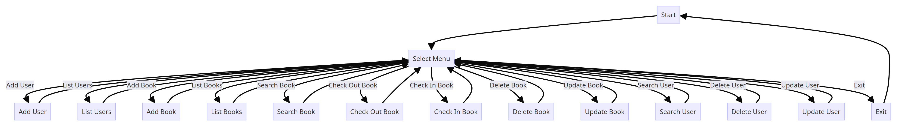

# Sample_APP

# Library Management System

This is a simple library management system implemented in Python with a Streamlit web interface.

## Features

- Add User: Add a new user to the system.
- List Users: View a list of all users in the system.
- Add Book: Add a new book to the library.
- List Books: View a list of all books in the library.
- Search Book: Search for a book by title, author, or ISBN.
- Check Out Book: Check out a book from the library.
- Check In Book: Return a checked-out book to the library.
- Delete Book: Remove a book from the library.
- Update Book: Modify details of an existing book.
- Search User: Search for a user by name or user ID.
- Delete User: Remove a user from the system.
- Update User: Modify details of an existing user.

## How to Run

1. Install the required Python packages: `pip install streamlit --upgrade`.
2. Run the Streamlit app: `streamlit run web_app.py`.
3. We can run the app headless by typing `python3 main.py`.
4. Use the interface to interact with the library management system.

# Flow Diagram

